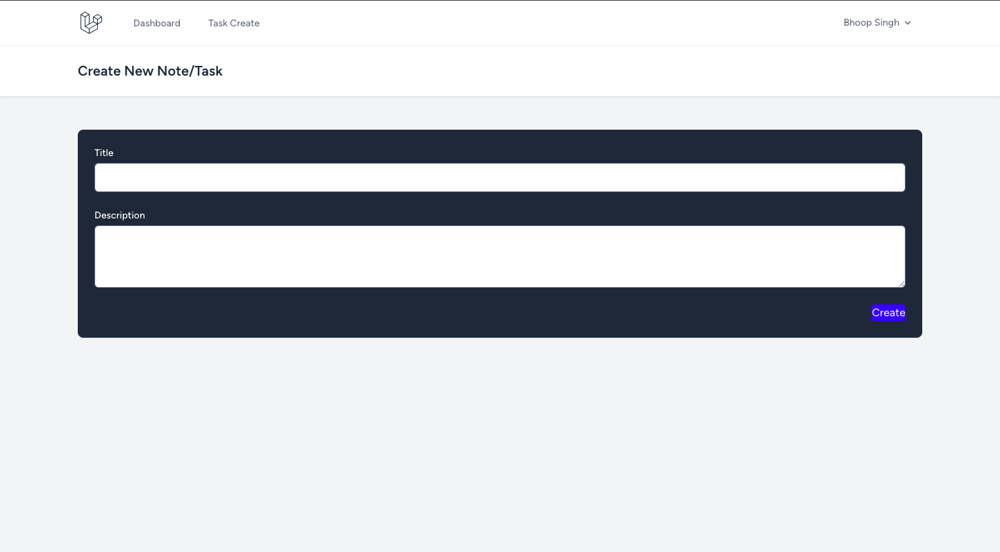
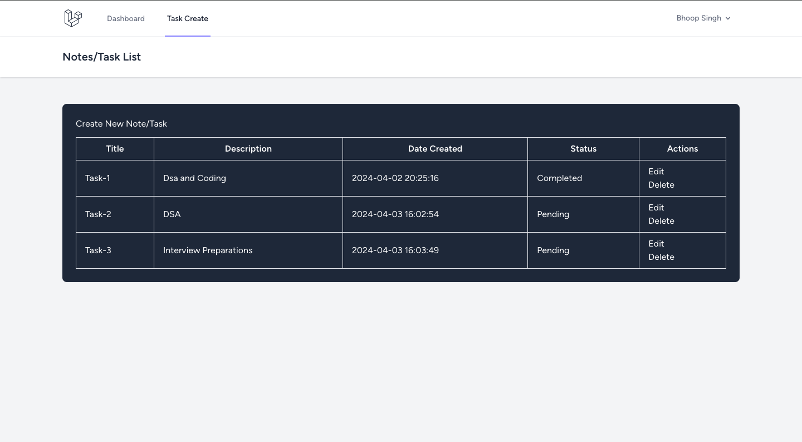

# To-Do-Application

This is a simple Todo application built with PHP Laravel framework. It allows users to create, manage, and share tasks or notes.

## Features

- User authentication: Register, login, and logout functionality.
- Create, read, update, and delete (CRUD) operations for notes/tasks.
- Mark tasks as completed.
- Share notes/tasks with other users via a shareable link.
- User-friendly interface.

## Getting Started

To run this application locally, follow these steps:

### Prerequisites

Make sure you have the following installed on your machine:

- PHP >= 7.3
- Composer (Dependency Manager for PHP)
- Node.js and npm (for frontend assets)

## Run LocalHost
Visit http://localhost:8000 in your browser to see the application running.

### Installation

1. Clone the repository:

   ```bash
   git clone https://github.com/bhupirao/Todo-App.git

## Image of Some Features 


